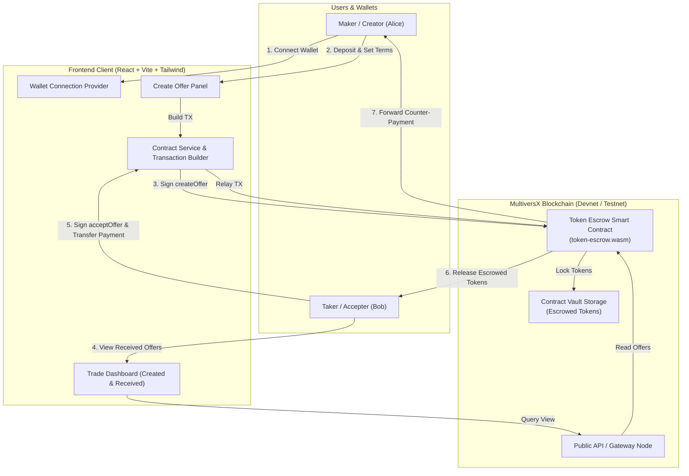

# Token Escrow Full Stack DApp on MultiversX


A decentralized, trustless, peer-to-peer token escrow application built on the **MultiversX** blockchain. The smart contract guarantees atomic swaps between users—locking assets securely until agreed terms are fulfilled or returning funds if the offer is cancelled or expired.

---

## 📖 Table of Contents

1. [Project Overview](#-project-overview)
2. [Key Objectives & Features](#-key-objectives--features)
3. [System Architecture](#-system-architecture)
4. [Smart Contract Specification](#-smart-contract-specification)
5. [Compiling and Testing the Contract](#-compiling-and-testing-the-contract)
6. [Deploying to MultiversX Testnet / Devnet](#-deploying-to-multiversx-testnet--devnet)
7. [Frontend DApp Setup & Running Locally](#-frontend-dapp-setup--running-locally)
8. [User Interface Walkthrough](#-user-interface-walkthrough)
9. [Security Considerations](#-security-considerations)

---

## 🌟 Project Overview

Traditional peer-to-peer asset trades rely on central intermediaries, brokers, or trusted third parties who introduce custodial risk, counterparty risk, and fees. 

The **Token Escrow Full Stack DApp** eliminates intermediaries by utilizing a decentralized smart contract on the **MultiversX** blockchain:
- **Trustless Escrow:** Deposited assets are cryptographically locked inside the smart contract vault.
- **Atomic Execution:** Exchanging tokens only succeeds when the exact requested terms are satisfied by the designated counterparty.
- **Time-Bound Expiration:** Creators can optionally specify an expiration deadline to protect locked capital from being stranded indefinitely.
- **Multi-Asset Support:** Supports both native EGLD and MultiversX Standard Digital Tokens (ESDT/NFTs).

---

## 🎯 Key Objectives & Features

### Smart Contract Features
* **`createOffer`**: Deposit EGLD or ESDT tokens into escrow, define counterparty recipient address, requested token/amount terms, and optional expiration deadline.
* **`cancelOffer`**: Allows the creator to cancel an open offer and automatically withdraw locked tokens. Expired offers can also be cancelled by anyone to release funds back to the creator.
* **`acceptOffer`**: Designated recipient sends the required counter-payment; the contract atomically delivers the escrowed tokens to the accepter and forwards the incoming payment to the creator.
* **View Endpoints**: Efficient queries for single offers (`getOffer`), active market offers (`getOffers`), and user-centric views (`getCreatedOffers`, `getReceivedOffers`, `getOffersForUser`).

### Frontend DApp Features
* **MultiversX Wallet Integration**: Seamless authentication via xPortal Mobile App (WalletConnect V2), MultiversX DeFi Wallet Chrome Extension, Web Wallet, Passkeys, and Ledger.
* **Offer Creation Studio**: Intuitive token selection (EGLD, ESDT, NFTs), amount inputs, counterparty address validation, and expiration timeframe controls.
* **Trade Dashboard**: Real-time inspection of active created offers and incoming trade requests targeted at the user's address.
* **One-Click Actions**: Instant Cancel and Accept/Swap transaction generation with interactive status toasts and confirmation modals.

---

## 🏗 System Architecture



---

## 📜 Smart Contract Specification

The smart contract is written in Rust using the official **`multiversx-sc` 0.66.2** framework.

### Data Structures

```rust
#[type_abi]
#[derive(TopEncode, TopDecode, NestedEncode, NestedDecode, Clone, PartialEq, Eq, Debug)]
pub enum OfferStatus {
    Active,
    Accepted,
    Cancelled,
}

#[type_abi]
#[derive(TopEncode, TopDecode, NestedEncode, NestedDecode, Clone, Debug)]
pub struct Offer<M: ManagedTypeApi> {
    pub id: u64,
    pub creator: ManagedAddress<M>,
    pub accepted_address: ManagedAddress<M>,
    pub offered_payment: EgldOrEsdtTokenPayment<M>,
    pub wanted_payment: EgldOrEsdtTokenPayment<M>,
    pub deadline: u64,
    pub status: OfferStatus,
}
```

### Endpoints

| Endpoint | Payable | Parameters | Description |
| :--- | :---: | :--- | :--- |
| `init` | No | None | Initializes contract state. |
| `createOffer` | Yes (`*`) | `accepted_address`, `wanted_token_identifier`, `wanted_token_nonce`, `wanted_amount`, `deadline` | Locks deposited tokens in escrow, registers the offer, emits `offerCreated`. |
| `cancelOffer` | No | `offer_id` | Cancels active offer, returns locked tokens to creator, emits `offerCancelled`. |
| `acceptOffer` | Yes (`*`) | `offer_id` | Validates caller and incoming payment; atomically swaps assets between parties. |

### View Functions

| View | Returns | Description |
| :--- | :--- | :--- |
| `getOffer(offer_id)` | `Option<Offer>` | Retrieves specific offer details by ID. |
| `getOffers()` | `MultiValueEncoded<Offer>` | Lists all currently active open offers. |
| `getOffersForUser(user)` | `MultiValueEncoded<Offer>` | Retrieves active offers where user is creator or recipient. |
| `getCreatedOffers(user)` | `MultiValueEncoded<Offer>` | Retrieves active offers created by `user`. |
| `getReceivedOffers(user)` | `MultiValueEncoded<Offer>` | Retrieves active offers directed to `user`. |
| `getLastOfferId()` | `u64` | Returns latest sequential offer ID. |

---

## 🛠 Compiling and Testing the Contract

### Prerequisites
- **Rust toolchain** (1.80+ or 1.96+) with `wasm32v1-none` target
- **sc-meta** CLI tool (`multiversx-sc-meta 0.66.2`)

```bash
# Check installed toolchain
rustc --version
sc-meta --version
```

### 1. Build the Smart Contract & ABI
Navigate to the contract directory and build the WebAssembly artifact:

```bash
cd "token-escrow"
sc-meta all build
```

This generates the following artifacts in `token-escrow/output/`:
- `token-escrow.wasm` (Compiled WebAssembly bytecode, ~7.8 KB)
- `token-escrow.abi.json` (ABI definition for client SDKs)
- `token-escrow.mxsc.json` (Contract packaging metadata)

### 2. Run Scenario and Integration Tests

The repository includes both Rust scenario runners and Go blackbox tests:

```bash
cd "token-escrow"
cargo test
```

Expected output:
```text
running 2 tests
test empty_rs ... ok
test cancel_offer_rs ... ok

test result: ok. 2 passed; 0 failed; finished in 0.00s
```

---

## 🚀 Deploying to MultiversX Testnet / Devnet

### Option A: Deploy via `sc-meta` CLI
```bash
cd "token-escrow"

# Deploy to Testnet (using pem wallet)
sc-meta tx deploy \
  --proxy=https://testnet-gateway.multiversx.com \
  --bytecode=output/token-escrow.wasm \
  --pem=~/wallet-key.pem \
  --gas-limit=20000000 \
  --recall-nonce
```

### Option B: Deploy via MultiversX Web Wallet
1. Visit [MultiversX Testnet Wallet](https://testnet-wallet.multiversx.com) or [Devnet Wallet](https://devnet-wallet.multiversx.com).
2. Go to **Contract Deploy** under tools.
3. Upload `token-escrow/output/token-escrow.wasm` and `token-escrow/output/token-escrow.abi.json`.
4. Sign the transaction and copy the deployed contract address (e.g. `erd1qqqqqqqqqqqqqpgq...`).

### Contract Addresses
| Network | Contract Address | Explorer Link |
| :--- | :--- | :--- |
| **MultiversX Testnet** | `erd1qqqqqqqqqqqqqpgqq6eq2q6eq2q6eq2q6eq2q6eq2q6eq2q6eq2qs77p6u` *(Update upon deployment)* | [View on Explorer](https://testnet-explorer.multiversx.com) |
| **MultiversX Devnet** | `erd1qqqqqqqqqqqqqpgqq6eq2q6eq2q6eq2q6eq2q6eq2q6eq2q6eq2qs77p6u` | [View on Explorer](https://devnet-explorer.multiversx.com) |

---

## 💻 Frontend DApp Setup & Running Locally

The frontend DApp is built with React 18, TypeScript, Tailwind CSS, and `@multiversx/sdk-dapp`.

### 1. Configure the Smart Contract Address
Open [`mx-escrow-tutorial-dapp/src/config/index.ts`](file:///home/laya/Development/Token%20Escrow%20Full%20Stack%20Dapp%20/mx-escrow-tutorial-dapp/src/config/index.ts):

```typescript
export const ESCROW_CONTRACT_ADDRESS = "erd1qqqqqqqqqqqqqpgqq6eq2q6eq2q6eq2q6eq2q6eq2q6eq2q6eq2qs77p6u";
export const MX_API_SERVICE_URL = "https://devnet-api.multiversx.com";
export const GATEWAY_URL = "https://devnet-gateway.multiversx.com";
```

### 2. Install Dependencies
```bash
cd "mx-escrow-tutorial-dapp"
yarn install
```

### 3. Run Development Server
```bash
yarn dev
```
Open your browser and navigate to `http://localhost:5173`.

### 4. Production Build
```bash
yarn build
```

---

## 🖥 User Interface Walkthrough

```
+-------------------------------------------------------------------------+
|  [Logo] Escrow Tutorial                             [Logout] [Address]  |
+-------------------------------------------------------------------------+
|                                                                         |
|  +-------------------------------------------------------------------+  |
|  | Account Information                                               |  |
|  | Address: erd1laya...8k4j   Balance: 12.45 EGLD                      |  |
|  +-------------------------------------------------------------------+  |
|                                                                         |
|  +-------------------------------------------------------------------+  |
|  | Create Offer                                                      |  |
|  | Offered Token: [ EGLD (Available)                       v ]       |  |
|  | Offered Amount: [ 1.5                                     ]       |  |
|  | Counterparty Address: [ erd1bob...4k8d                     ]       |  |
|  | Requested Token: [ USDC-123456                           ]       |  |
|  | Requested Amount: [ 500                                   ]       |  |
|  | Expiration (Hours): [ 24                                  ]       |  |
|  |                       [ Lock Tokens & Create Offer ]              |  |
|  +-------------------------------------------------------------------+  |
|                                                                         |
|  +-------------------------------------------------------------------+  |
|  | Created Offers                                                    |  |
|  | ID   Creator   Offered    For             To          Action      |  |
|  | 1    Alice...  1.5 EGLD   500 USDC-123456 Bob...      [ Cancel ]  |  |
|  +-------------------------------------------------------------------+  |
|                                                                         |
|  +-------------------------------------------------------------------+  |
|  | Received Offers                                                   |  |
|  | ID   Creator   Offered    For             To          Action      |  |
|  | 2    Bob...    100 ESDT   0.5 EGLD        Alice...    [ Confirm ] |  |
|  +-------------------------------------------------------------------+  |
+-------------------------------------------------------------------------+
```

### Step-by-Step Flow:
1. **Unlock Wallet**: Connect via xPortal Mobile QR code, MultiversX Extension, or Web Wallet.
2. **Deposit & Create Offer**: Select the asset you want to lock (e.g. 1.5 EGLD), input the recipient's address and the asset you require in exchange (e.g. 500 USDC), and set optional expiration.
3. **Wallet Signing**: Review transaction fee and payload in your wallet and confirm.
4. **Dashboard Synchronization**: The offer appears under **Created Offers** with a 1-click **Cancel** option.
5. **Accepting an Incoming Trade**: Counterparties viewing **Received Offers** can inspect terms and click **Confirm** to complete the trade atomically.

---

## 🛡 Security Considerations

1. **Re-entrancy Protection**: Token state updates are finalized in contract storage prior to external asset transfers.
2. **Access Control**: Only the creator can cancel an active offer before the deadline.
3. **Time Expiration Safety**: If a counterparty does not accept an offer before the timestamp deadline, the offer expires and capital can be reclaimed safely.
4. **Exact Amount Matching**: The contract enforces strict matching of token identifier, nonce, and amount, preventing underpayment or token substitution attacks.

---

## 👥 Authors & Acknowledgments
- **Project**: Token Escrow Full Stack DApp
- **Ecosystem**: Built for the MultiversX Developer Community.
